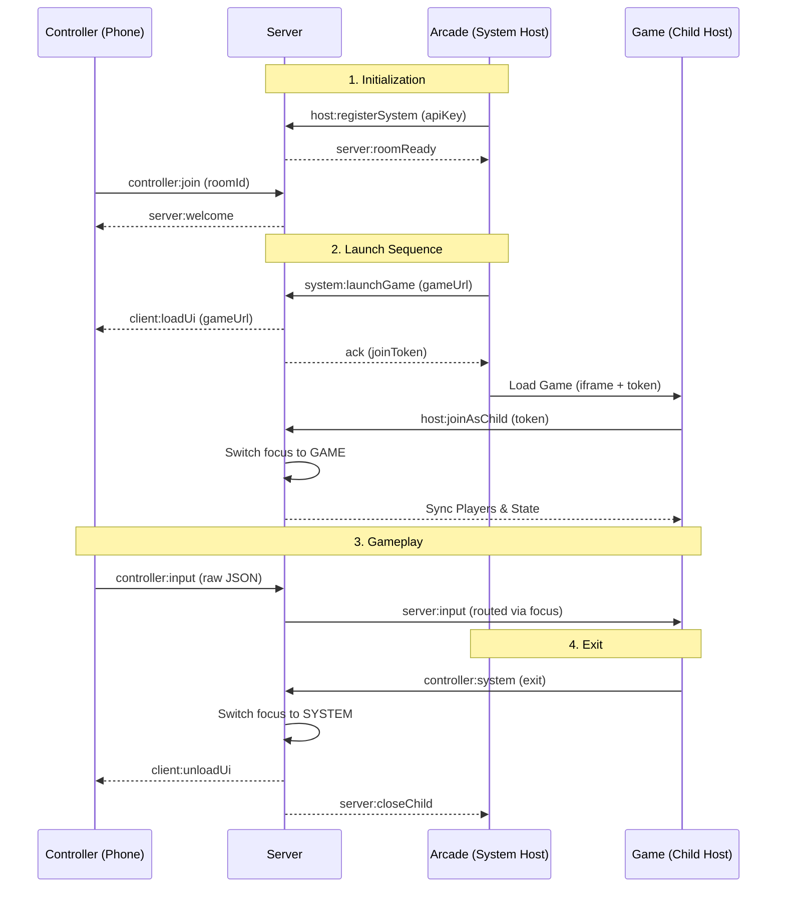

# Air Jam System Overview

Air Jam is a high-performance platform for building smartphone-controlled multiplayer games. It enables a "Dual-Host" architecture where a computer or TV acts as the primary display while smartphones serve as low-latency game controllers.

---

## 🏗️ Architecture Matrix

Air Jam is organized as a monorepo containing four specialized core modules:

| Component | Path | Role | Tech Stack |
| :--- | :--- | :--- | :--- |
| **Platform** | `apps/platform` | Developer Portal & Arcade Hub | Next.js 15, tRPC, PostgreSQL |
| **Server** | `packages/server` | Real-time Communication Backbone | Node.js, Socket.IO |
| **SDK** | `packages/sdk` | Developer Toolkit | React, TypeScript, Zustand |
| **Prototype** | `apps/prototype-game` | Reference Implementation | Three.js, Rapier Physics |

---

## 🧠 The Focus System: Dual-Host Mechanics

The core innovation of Air Jam is the **Server-Authoritative Focus System**. This allows the server to dynamically route controller inputs between the **System Host** (the Arcade launcher) and the **Child Host** (the active game).

### Focus States
- **`SYSTEM` Focus**: Default state. Inputs are routed to the Arcade (Master Host).
- **`GAME` Focus**: Active gameplay state. Inputs are routed to the Game (Child Host).

### Connection Flow Lifecycle

---

## 🛠️ Developer Toolkit (SDK)

The `@air-jam/sdk` provides a high-level API for both games and controllers, abstracting socket management into type-safe React hooks.

### Core Hooks
- `useAirJamHost`: Primary hook for games. Handles connection, player syncing, and state management.
- `useAirJamController`: Primary hook for controller UIs. Handles joining rooms and sending inputs.
- `useAirJamInput`: High-performance, **zero re-render** input buffer using refs. Essential for 60FPS game loops.
- `useAirJamInputLatch`: Advanced input processing that prevents "missing" rapid taps (latches pulses to the next frame).
- `useAirJamHostSignal`: "Fire and forget" communication for transient effects (Haptics, Toasts).

---

## 💻 Local Development & Standalone Mode

Air Jam is designed to be frictionless for local development. You do not need a production API key or the official platform to start building.

### Standalone Mode (Zero Config)
When the SDK detects it is **not** running in an iframe (Standalone Mode), it defaults to a simplified registration flow:
- **API Key Bypass**: The server's `host:register` handler allows room creation without authentication. This is intended for rapid prototyping and testing.
- **Direct Connect**: Bypasses the the requirement for the Platform. Developers can simply open the game URL in a browser. The SDK will automatically detect it's in `standalone` mode (not in an iframe).

### Running Locally
1. **Start Server**: `cd packages/server && pnpm dev` (Runs on port 4000).
2. **Start Game**: `cd apps/prototype-game && pnpm dev` (Runs on port 5173).
3. **Connect**: Open `localhost:5173` on your PC and the generated URL on your phone (see URL Mechanics below).

---

## 🔗 URL Mechanics & Mobile Connectivity

Connecting mobile devices to a local dev environment can be tricky due to network isolation. Air Jam's `UrlBuilder` manages this automatically.

### Local IP Detection
- **Host Discovery**: When running on `localhost`, the SDK attempts to detect your machine's **Local Network IP** (e.g., `192.168.1.5`).
- **Mobile URLs**: It replaces `localhost` with this IP in the generated QR code/Join URL so your phone can resolve the address over Wi-Fi.

### Mode Detection via Query Params
The SDK uses specific URL parameters to determine how it should behave:
| Parameter | Purpose | Source |
| :--- | :--- | :--- |
| `aj_room` | The room code to join. | `GamePlayer` / SDK |
| `aj_token` | One-time join token for child hosts. | `GamePlayer` / SDK |
| `airjam_force_connect` | Forces SDK initialization regardless of nested state. | Developer Override |

---

## 🚀 Deployment & Production Flow

Air Jam supports a seamless transition from a "Project on your machine" to a "Game in the Arcade".

### 1. Standalone Deployment (The Dev Stage)
Game creators deploy their game to any static host (Vercel, GitHub Pages). 
- **Direct Play**: Anyone with the link can play by connecting controllers directly.
- **Independence**: No dependence on the Air Jam Platform UI.

### 2. Arcade Integration (The Platform Stage)
Once ready, the dev registers the game on the **Platform**:
- **API Key**: Issued for production usage tracking and security.
- **Meta-Data**: Icons, descriptions, and player limits are configured.
- **Instant Availability**: The game appears in the **Air Jam Arcade**. When launched, it transitions into **Child Mode** automatically, receiving players and instructions from the system host.

---

---

## 🏎️ Input & Communication

### Type-Safe Input Pipeline
Air Jam uses **Zod** for runtime schema validation. This ensures that a game only receives inputs it expects, and that those inputs are fully typed in TypeScript.
- **Unified Input API**: `useAirJamInput` combines raw buffer access with intelligent edge detection. It manages a centralized buffer in `AirJamClient` to ensure maximum performance across multiple game systems.
- **Built-in Logic**: The API provides `justPressed(field)`, `isDown(field)`, and `vector(field)` helpers, eliminating the need for manual latching or state tracking in the game loop.

### Communication Channels
| Channel | Type | Usage |
| :--- | :--- | :--- |
| **State** | Persistent | `host.sendState({ score: 100 })`. Syncs to all controllers. |
| **Signals** | Transient | `host.sendSignal({ type: 'haptic', level: 1 })`. For one-off events. |
| **Audio** | Hybrid | Trigger localized sounds on phone or host speakers via a unified API. |

---

## 🔄 Core Event Life Cycle

The following simplified event sequence represents the typical lifecycle of an Air Jam session:

1.  **Init**: Host registers (`host:register` or `host:registerSystem`).
2.  **Ready**: Server acknowledges and issues `roomId` (`server:roomReady`).
3.  **Join**: Controllers connect using the `roomId` (`controller:join`).
4.  **Sync**: Server transmits existing players and state to the new controller (`server:controllerJoined`).
5.  **Focus Shift**: (Optional) System host launches a game, switching focus to "GAME".
6.  **Loop**: Controllers send inputs (`controller:input`), Server routes to focused host.
7.  **Exit**: Game finishes or host disconnects, focus returns to "SYSTEM".

---

## 🧐 Technical Quirks & DevEx Recommendations

As the platform evolves, some architectural patterns and "refactor remains" should be noted for future development.

### Multi-Instance Support (SDK)
The SDK uses an `AirJamProvider` pattern that uses context-bound stores.
- **Improved**: You can have independent Air Jam instances in the same application lifecycle.
- **Status**: Migration from global singletons to Provider pattern is complete.

### Monolithic Server Entry
The server logic is primarily contained within a single `index.ts` (approx. 900 lines).
- **Quirk**: Event handlers for System, Game, and Controllers are all co-located, making it harder to track specific logic branches.
- **Recommendation**: Move Socket.io handlers into separate service-specific modules (e.g., `controller-service.ts`, `host-service.ts`).

### Refactor Remains
- **Cleaned**: Legacy `AIRJAM_PROXY_PREFIX` and `AIRJAM_STATE` protocols have been removed in favor of the unified Socket.io events.
- **Action**: Developers should regularly check for backup files (e.g., `.backup`, `.bak`) which are occasionally left behind during large refactors.

---

## 🛡️ Security & Identity

Air Jam provides a balance between ease of use and production security.

- **API Keys**: Required for System Hosts (Arcade) to authenticate with the platform.
- **Join Tokens**: Unique, short-lived UUIDs generated by the server for Child Hosts to join a room securely after a `system:launchGame` command.
- **Player Profiles**: Persistent identifiers (`playerId`) and nicknames that follow a user across different games in the same session.

---

## �️ Future Roadmap

- **Latency Optimization**: Exploring WebRTC DataChannels for sub-10ms input latency.
- **Custom Controller Builders**: A drag-and-drop UI for designers to build controllers without code.
- **Persistence Layer**: Cross-session player stats and leaderboards.
- **Advanced JSDoc**: Comprehensive inline documentation for easier SDK adoption.
