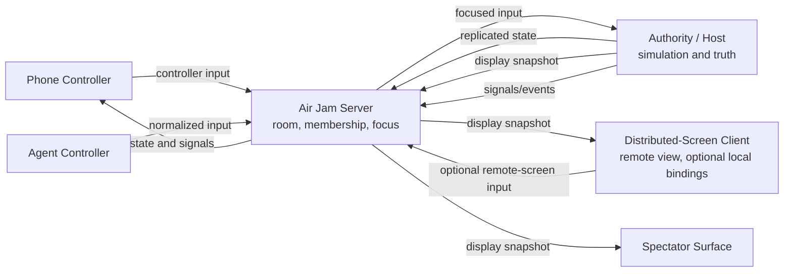

# Remote Rooms And Display Surfaces Plan

Last updated: 2026-04-24  
Status: planned future architecture

Related docs:

1. [Vision](../vision.md)
2. [Framework Paradigm](../framework-paradigm.md)
3. [Deployment and Monetization Strategy](../strategy/deployment-and-monetization-strategy.md)
4. [Public Arcade Release Strategy](../strategy/public-arcade-release-strategy.md)
5. [Remote Rooms Prerelease Future-Proofing Plan](./remote-rooms-prerelease-future-proofing-plan.md)
6. [Air Jam MCP And Agent Devtools Plan](./air-jam-mcp-and-agent-devtools-plan.md)
7. [Work Ledger](../work-ledger.md)

## Purpose

Define the future direction for growing Air Jam beyond shared-screen rooms into distributed-screen rooms, optional remote display and spectator surfaces, and later advanced authority backends.

This plan exists so Air Jam does not accidentally lock itself into:

1. shared-screen-only product assumptions
2. stretching the controller lane into every future remote-play problem
3. pixel-mirroring as the remote-play answer
4. a premature rewrite into a full online-game backend
5. a future Air Jam 2.0 migration that requires throwing away the current runtime model

The intended direction is:

1. keep shared-screen play as the simple default and the v1 product truth
2. make shared-screen rooms easier to share remotely
3. add distributed-screen play later as a separate play mode, not a rewrite of the controller lane
4. keep phone controllers as a first-class second-screen surface
5. add optional display and distributed-player surfaces that render declared snapshots
6. later support server-authoritative runtimes as an advanced mode

## Core Decision

Air Jam should evolve from:

> one play mode: shared-screen phone-controller rooms

into:

> one framework with two play modes: shared-screen rooms and distributed-screen rooms.

The controller lane can stay phone-native.
The future expansion should come from adding a new distributed-screen surface, not from forcing the existing controller lane to mean everything.

## Why This Fits Air Jam

The current framework already has the right foundation:

1. room identity
2. controller identity and reconnect leases
3. host authorization
4. server-owned focus and routing
5. input lane
6. replicated state lane
7. signal and command lane
8. Arcade shell vs embedded game ownership
9. hosted publishing direction
10. future agent control and inspection direction

Distributed-screen rooms are therefore not a separate product architecture.

They are an extension of the same core idea:

1. one owner per fact
2. one authority for gameplay truth
3. explicit input contracts
4. explicit replicated state contracts
5. explicit display contracts when a room should be viewed remotely

## Play Modes

Air Jam should eventually support two product-facing play modes:

### 1. Shared-Screen

This is Air Jam today.

Characteristics:

1. one main host screen
2. phones act as controllers
3. great for couch, party, classroom, event, and streamer-hosted play
4. remote friends can still participate by using their phone while watching a stream

### 2. Distributed-Screen

This is the future expansion.

Characteristics:

1. remote players can have their own game view
2. rooms can support watch-only or interactive remote screens
3. keyboard, mouse, or gamepad input may make sense here for some games
4. this is a separate play mode, not a relabeling of the current controller lane

The platform and catalog can present these as separate modes later even if the room model under the hood stays shared.

## Product Model

The future product should explain rooms in human terms:

1. create a room
2. invite players
3. choose how each person joins
4. play locally or remotely
5. optionally watch from another screen

Recommended public labels:

1. **Join as player**
2. **Use phone as controller**
3. **Join remote screen**
4. **Watch room**
5. **Share room**

Avoid public labels like:

1. controller socket
2. mirror runtime
3. remote replication session
4. host stream
5. state database

## Runtime Surfaces

The current public authoring model has two surfaces:

```text
Host
Controller
```

The future model should become:

```text
Authority / Host
Controller
Display / Distributed Player Surface
Arcade Shell
Agent
```

This does not mean the v1 public SDK should expose all of these immediately.

It means the architecture should stop assuming that every future player experience must fit into the controller lane.

### Authority / Host

Owns gameplay truth.

In the default model this is still a browser host:

1. standalone game host
2. Arcade shell host
3. embedded game host
4. future server runtime authority

The host decides:

1. simulation
2. collisions
3. score
4. match phase
5. authoritative game state
6. display snapshot contents

### Controller

Publishes second-screen player input.

In Air Jam, this should stay a phone-native lane unless and until there is a real reason to broaden it.

Typical controller responsibilities:

1. touch UI
2. motion controls
3. haptics
4. private player information
5. lightweight role-specific controls

The controller lane does not need to become the answer for desktop play.

### Display / Distributed Player Surface

Subscribes to room display state.

It does not own gameplay truth.
It may be read-only or interactive depending on the game and play mode.

It renders:

1. world snapshots
2. scores
3. match phase
4. player roster
5. lightweight visual events

In distributed-screen games, this surface may also own:

1. keyboard bindings
2. pointer bindings
3. gamepad bindings
4. on-screen HUD and menus

That input belongs to the distributed-screen mode, not the phone-controller mode.

Display or distributed-player surfaces should be optional per game.

### Arcade Shell

Owns platform UX:

1. browser vs game surface
2. room sharing
3. player join UX
4. room owner controls
5. game launch and exit
6. public Arcade polish

The Arcade shell should not become gameplay authority.

### Agent

Future machine participant.

Agents may:

1. join as virtual controllers
2. inspect runtime state
3. subscribe to display snapshots
4. run visual or gameplay evaluations
5. drive automated test scenarios

Agent control should reuse the same room and input contracts as human player surfaces.

## Visual Model



## Remote Play Example

Air Capture with a friend on Discord:

1. Tim opens Air Capture in Arcade.
2. Tim's browser creates the room and owns the authoritative simulation.
3. Tim shares a room link.
4. The friend opens the link.
5. The friend chooses:
   1. join remote screen
   2. use phone as controller
   3. watch only
6. If Air Capture only supports shared-screen play, the friend uses their phone as controller and watches through Discord or Twitch.
7. If Air Capture later supports distributed-screen play, the friend's browser opens a distributed player surface that renders from display snapshots and may expose local keyboard or gamepad bindings.
8. Watch-only users can still open a spectator surface when the game provides one.

This means remote play can ship in useful layers.

The first useful layer is not full mirrored rendering.
The first useful layer is remote player input plus normal stream/watch behavior.

## What "Mirror" Should Mean

Air Jam should avoid promising automatic pixel mirroring.

Pixel mirroring is video streaming.
That is a different product with different infrastructure, latency, bandwidth, moderation, and cost problems.

In Air Jam, a mirrored or remote view should mean:

> the host publishes a typed display snapshot, and display clients render from that snapshot.

This keeps the model aligned with the current replicated state direction.

## Display Snapshot Lane

The likely future primitive is a display snapshot lane.

Conceptual host code:

```tsx
useDisplaySnapshot(() => ({
  phase,
  score,
  aircraft: players.map((player) => ({
    id: player.id,
    team: player.team,
    position: player.position,
    rotation: player.rotation,
    boost: player.boost,
  })),
  bases,
}));
```

Conceptual display code:

```tsx
const snapshot = useAirJamDisplay();

return <AirCaptureDisplayScene snapshot={snapshot} />;
```

The SDK should own:

1. validation
2. throttling
3. reconnect replay
4. snapshot delivery
5. optional interpolation helpers
6. default loading and missing-display states

The game should own:

1. what the display snapshot contains
2. how the display renders that snapshot
3. which visual-only effects are worth sending
4. how much fidelity the remote display needs

## What Can Be Automatic

Air Jam can make these automatic:

1. display join URLs
2. room membership
3. capability checks
4. transport
5. snapshot replay after reconnect
6. snapshot validation
7. snapshot rate limiting
8. simple interpolation helpers
9. display client connection status
10. fallback UI if no display surface exists

Air Jam cannot safely make these automatic:

1. extracting arbitrary Three.js scene state
2. extracting arbitrary Rapier physics world state
3. deciding which game objects matter
4. deciding how to render a remote scene
5. deciding what local-only effects should be replayed
6. turning any arbitrary React app into a synchronized online game

That boundary is important.

If Air Jam tries to make arbitrary mirroring automatic, the system will become fragile and confusing.

The clean model is:

1. automatic infrastructure
2. explicit game-owned snapshot contract
3. optional game-owned display renderer

## Input Action System

Distributed-screen games become much stronger if Air Jam later adds a small action or binding system for on-screen remote clients.

Future conceptual contract:

```ts
actions: {
  steer: { type: "axis2d" },
  throttle: { type: "axis1d" },
  boost: { type: "button" },
  fire: { type: "button" },
}
```

Different distributed-screen bindings can map to the same actions:

```text
keyboard WASD        -> steer
gamepad left stick   -> steer
keyboard Space       -> boost
gamepad A            -> boost
```

This should be additive beside today's phone-controller lane, not a replacement for it.

The host still receives normalized input.

This keeps gameplay code clean:

1. game logic reads actions
2. phone controller UI owns second-screen presentation
3. distributed-screen surfaces own their local bindings
4. accessibility adapters can map into the same contract
5. agents can discover and execute available actions

This should be additive.

Do not force v1 games to adopt a large Unity-style input system before the need is proven.

## Relationship To Existing Replicated State

The display snapshot lane should reuse the existing architectural idea behind `createAirJamStore`:

1. host owns truth
2. controllers and displays receive snapshots
3. reconnect should replay current state
4. transient input stays out of replicated state
5. facts have one owner

However, display snapshots should not be treated as gameplay authority by default.

The clean distinction:

```text
Replicated game state:
  durable gameplay facts and controller-readable state

Display snapshot:
  renderable remote-view state derived from gameplay/runtime state

Input lane:
  high-frequency player intent from controllers to authority
```

Some games may choose to use the same underlying data for replicated game state and display snapshots.
That is fine.

The framework should still name the lanes separately so authors understand intent.

## Relationship To SpacetimeDB And Server Authority

Air Jam should not rewrite around SpacetimeDB or any database-authoritative runtime before v1.

Those systems are interesting for a later advanced mode where the server is the gameplay authority.

But making a database/runtime authority the default would change the product:

1. games become backend-simulation projects
2. local browser-first authoring gets heavier
3. simple party games become harder
4. the current SDK value becomes less direct
5. AI-generated games need to satisfy a stricter simulation model too early

The better path is:

1. keep browser host authority as the default
2. add remote input
3. add optional display snapshots
4. add an advanced server-authoritative authority adapter later
5. evaluate SpacetimeDB-like systems only for that advanced adapter

The current system should not be discarded.

It should be widened carefully.

### Adapter Decision

Air Jam should not become a SpacetimeDB wrapper.

The more durable direction is:

> Air Jam owns the room, input, surface, display, publish, and agent-facing contracts. Authority backends can plug into those contracts when a game needs them.

Possible authority modes:

```text
Browser Host Authority
  Current/default mode. Best for fast browser-first games, party games,
  AI-generated prototypes, local Arcade rooms, and streamer-owned rooms.

Managed Air Jam Authority
  Future mode where Air Jam runs the game authority in a worker, sandbox,
  hosted process, or Studio-managed runtime.

External Authority Adapter
  Future mode where a game uses an external authoritative backend such as
  SpacetimeDB, a custom game server, Nakama, Colyseus, or another purpose-built
  runtime while still exposing Air Jam-compatible room/input/display contracts.
```

SpacetimeDB may be a strong fit for an **external shared game state adapter** or **server-authoritative state adapter** when the game naturally maps to:

1. tables/entities
2. reducers/actions
3. subscribed read models
4. persistent rooms or worlds
5. server-verified gameplay decisions
6. thin clients that render server-owned state

It is probably not the right default for:

1. simple browser-first party games
2. fast local creative iteration
3. Three/Rapier-heavy host simulations
4. games whose interesting state lives in local render/physics objects
5. AI-generated games where the easiest good result matters more than strict backend authority

The framework boundary should therefore be:

```text
Air Jam Room Contract
  input actions in
  authoritative state out
  display snapshots out
  lifecycle/events out
  logs/inspection out

Authority Backend
  browser host
  Air Jam managed runtime
  SpacetimeDB module
  custom backend
```

This gives Air Jam a clean future path without making one backend technology the product's center of gravity.

The test for adopting a SpacetimeDB-like adapter later should be practical:

1. pick one real first-party game or prototype that genuinely needs server authority or persistent shared state
2. build the adapter behind Air Jam's room/input/display contracts
3. compare authoring complexity against the browser-host version
4. keep it only if the game becomes simpler, more robust, or meaningfully more scalable
5. avoid promoting it to the default unless most Air Jam games clearly benefit

## Authoring Shape

Future game structure may become:

```text
src/
  host/
    index.tsx
  controller/
    index.tsx
  display/
    index.tsx
  game/
    domain/
    engine/
    systems/
    adapters/
    ui/
```

`display/` should be optional.

Games without remote display support should still be valid Air Jam games.

Potential future SDK shape:

```tsx
const airjam = createAirJamApp({
  input,
  display: {
    schema: displaySnapshotSchema,
  },
});

<airjam.Host>
  <HostGame />
</airjam.Host>

<airjam.Controller>
  <ControllerSurface />
</airjam.Controller>

<airjam.Display>
  <DisplaySurface />
</airjam.Display>
```

The public concept should remain simple:

1. host owns the game
2. controller sends input
3. display watches the room

## Upgrade Path

### Phase 0. Prerelease Preparation

Do now, before first public release, only where cheap and low-risk.

Goal:

1. keep the public product framing honest about shared-screen phone-controller play
2. avoid adding more assumptions that every future remote experience must fit through the controller lane
3. document the future architecture clearly
4. keep v1 stable

Concrete prerelease work:

1. do not run a broad marketing rename pass before v1
2. avoid introducing new public APIs that would force future distributed-screen play to masquerade as controller play
3. add this plan to the docs index and work ledger
4. add durable suggestions for play modes, display snapshots, and distributed-screen bindings
5. keep `Host` and `Controller` public APIs for v1; do not rename them before release
6. keep `Display` private or unimplemented before release unless there is a clear launch need
7. do not start a server-authoritative rewrite before v1
8. do not introduce SpacetimeDB or similar authority infrastructure before v1
9. leave room-code, capability, and share-link language compatible with remote use
10. keep first-party games structured so display snapshots could be derived later from explicit game state instead of hidden UI-only state

### Phase 1. Remote Room Sharing

Goal:

Make shared-screen rooms easy to share online.

Features:

1. copyable room invite links
2. clear join-as-player flow
3. explicit room owner controls
4. better public/private room semantics
5. platform room page
6. streamer-friendly room overlays
7. remote-safe room-code entropy and abuse controls
8. analytics for room-hours and concurrent rooms

This phase does not require distributed-screen surfaces.

Players can still watch through Discord or Twitch.

### Phase 2. Distributed-Screen Surface

Goal:

Let games opt into remote display/spectator surfaces without becoming server-authoritative games.

Features:

1. display snapshot schema
2. host publish helper
3. display subscribe helper
4. display route or join flow
5. spectator mode and optional interactive remote-screen mode
6. snapshot replay on reconnect
7. throttling controls
8. interpolation helpers
9. optional binding helpers for distributed-screen clients
10. play-mode metadata for catalog and platform UX
11. visual harness support for display surfaces
12. docs and scaffold examples

This is the first phase where game authors may add `src/display/` or an equivalent distributed-screen surface.

### Phase 3. Room Participant Model

Goal:

Replace narrow internal host/controller indexing with a more explicit participant/surface model.

Potential internal concepts:

1. room participant id
2. participant kind
3. capabilities
4. player binding
5. display binding
6. authority binding
7. agent binding

This should be an internal migration first.

Public APIs should remain simple.

### Phase 4. Server-Authoritative Authority Mode

Goal:

Support games whose authoritative simulation runs outside a browser host.

Possible implementations:

1. Air Jam-managed worker runtime
2. game-owned authoritative backend
3. hosted sandbox process
4. SpacetimeDB-like adapter
5. future Studio-managed simulation runtime

This is an advanced mode.

It should not replace the simple host-authoritative model.

## Prerelease Do / Do Not

### Do Before V1

1. Document the direction.
2. Keep public product language honest about v1.
3. Keep input/state/signal lanes explicit.
4. Keep game state out of UI-only flows where practical.
5. Keep first-party games boundary-first.
6. Track distributed-screen surfaces and display snapshots as future architecture.
7. Avoid public names that make future distributed-screen or display surfaces awkward.

### Do Not Before V1

1. Do not rewrite the runtime around a database-authoritative model.
2. Do not rename the whole SDK from host/controller to authority/input before launch.
3. Do not promise automatic remote mirroring.
4. Do not make display snapshots release-blocking.
5. Do not require every game to ship a display surface.
6. Do not build multiplayer netcode for peer host sync.
7. Do not make the server owner of app-level gameplay state.
8. Do not blur the phone-controller lane with future distributed-screen play before that mode exists.

## Architecture Risks

### Risk 1. Stretching The Controller Lane Too Far

If Air Jam treats every future player experience as "just another controller," the current phone-controller lane will become muddled and the later distributed-screen mode will be harder to explain.

Mitigation:

1. keep `Controller` as the phone-native second-screen lane
2. add a separate distributed-screen surface later
3. keep product-facing play modes explicit

### Risk 2. Automatic Mirroring Promise

If Air Jam promises automatic mirroring, users will expect arbitrary games to become remote-viewable with no authoring work.

Mitigation:

1. use "display snapshot" language
2. explain that games opt in by exposing a view model
3. provide great helpers so the opt-in stays small

### Risk 3. Premature Server-Authority Rewrite

If Air Jam rewrites too early around server authority, simple games get harder before the remote-room product has been proven.

Mitigation:

1. keep browser host authority as default
2. add server authority as a later mode
3. evaluate database-authority tools only inside that mode

### Risk 4. Participant Model Churn

If the internal model is generalized too early, v1 release risk increases.

Mitigation:

1. document the intended model now
2. keep v1 host/controller APIs stable
3. migrate internals only when display or desktop-player work actually needs it

## Success Criteria

This direction is succeeding when:

1. a shared-screen game still feels simple to build
2. a streamer can create and share a room
3. a remote friend can still participate in shared-screen play through phone plus stream/watch flows
4. a distributed-screen game can optionally expose a remote player view without rewriting gameplay authority
5. first-party games can support both shared-screen and distributed-screen modes under one room model when it is worth it
6. agents can eventually control and inspect rooms through the same contracts
7. server-authoritative games are possible later without making them the default

## Recommended Near-Term Decision

Air Jam v1 should remain host/controller-first in public API and phone-controller-first in product framing.

Air Jam 2.0, or a post-v1 major runtime track, should be the likely place to introduce:

1. public `Display` surface
2. room participant model
3. first-class distributed-screen binding system
4. distributed-screen play metadata
5. optional server-authoritative authority mode

The current architecture should be evolved, not replaced.
